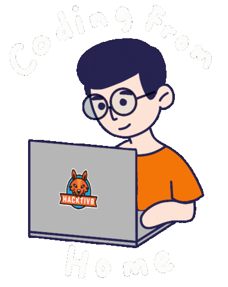
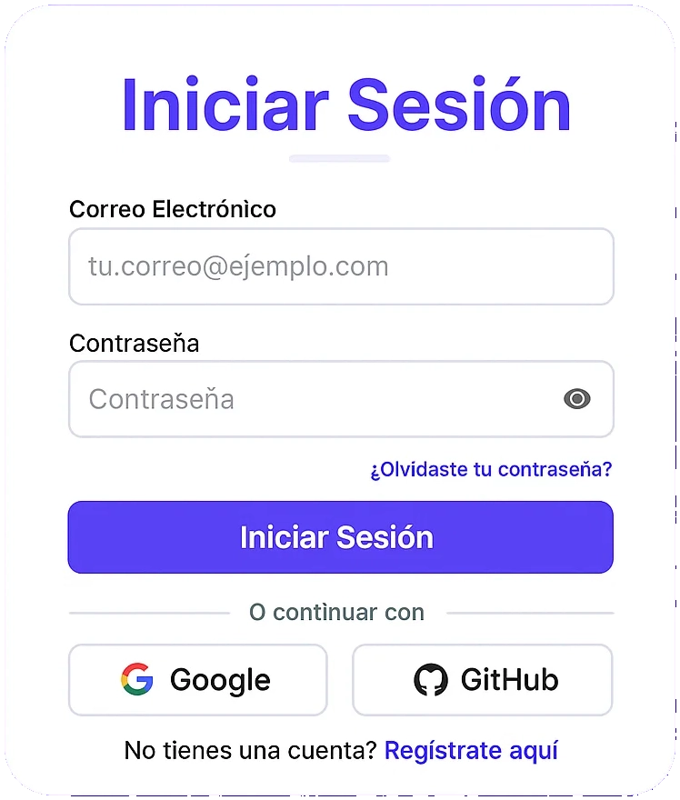

  
   
  <h1 style="color: #61DAFB; text-shadow: 0 0 10px rgba(97, 218, 251, 0.5);">¡Hola, soy Rafael Sanguino! 👋</h1>
  
Estudiante de Ingeniería de Sistemas | Apasionado por la creación de soluciones web seguras y desafiantes

   
  

    
    
  

  <h2 style="color: #61DAFB; text-shadow: 0 0 8px rgba(97, 218, 251, 0.5);">🚀 Sobre Mí</h2>
  
Soy un <strong style="color: #61DAFB;">Estudiante de Ingeniería de Sistemas</strong> en Bucaramanga, Santander, Colombia, con una fuerte y creciente pasión por convertirme en un desarrollador Full Stack. Mi objetivo es resolver problemas a través del código y crear soluciones robustas que impacten positivamente a los usuarios. ✨
 
Actualmente, me encuentro profundizando en el desarrollo de <strong style="color: #61DAFB;">aplicaciones web seguras</strong> y la mejora de la <strong style="color: #61DAFB;">experiencia de usuario</strong>, siempre buscando aplicar las mejores prácticas y explorar nuevas tecnologías que me impulsen hacia mi meta Full Stack. 💻
 

### 🎯 Mis Objetivos

<ul style="list-style: none; padding-left: 20px;">
  <li style="margin-bottom: 8px;"><strong style="color: #61DAFB;">Dominar el desarrollo Full Stack:</strong> Convertirme en un desarrollador competente tanto en el frontend como en el backend, construyendo soluciones de principio a fin. 🚀</li> <li style="margin-bottom: 8px;"><strong style="color: #61DAFB;">Creación de una Web App / Aplicación Móvil Nativa multiplataforma:</strong> Actualmente, estoy trabajando en un proyecto ambicioso para poner en práctica mis conocimientos y solidificar mi experiencia en desarrollo. 📱</li> <li style="margin-bottom: 8px;"><strong style="color: #61DAFB;">Contribuir a la comunidad de código abierto:</strong> Participar activamente en proyectos open source para aprender de otros y aportar valor. 🤝</li> <li style="margin-bottom: 8px;"><strong style="color: #61DAFB;">Crear soluciones innovadoras:</strong> Desarrollar aplicaciones que resuelvan problemas reales y mejoren la vida de las personas. 💡</li> </ul>

<h3 style="color: #ADD8E6;">🗺️ Mi Hoja de Ruta / Próximos Pasos</h3> <ul style="list-style: none; padding-left: 20px;">
  <li style="margin-bottom: 8px;"><strong style="color: #61DAFB;">Profundización en React y Next.js:</strong> Explorar patrones avanzados, rendimiento y mejores prácticas para construir aplicaciones frontend robustas. ⚛️</li> <li style="margin-bottom: 8px;"><strong style="color: #61DAFB;">Desarrollo de APIs con TypeScript:</strong> Integrar TypeScript en proyectos Node.js/Express para mejorar la mantenibilidad y escalabilidad. ✍️</li> <li style="margin-bottom: 8px;"><strong style="color: #61DAFB;">Exploración de bases de datos relacionales:</strong> Aprender SQL y trabajar con PostgreSQL para ampliar mis capacidades de persistencia de datos. 🗄️</li> <li style="margin-bottom: 8px;"><strong style="color: #61DAFB;">Implementación de CI/CD:</strong> Familiarizarme con herramientas como GitHub Actions y Vercel para automatizar el despliegue de mis aplicaciones. ⚙️</li> </ul>

### 💡 Intereses y Hobbies

Fuera del ámbito de la programación, disfruto de los <strong style="color: #61DAFB;">videojuegos</strong> 🎮. También me gusta <strong style="color: #61DAFB;">aprender sobre ciberseguridad</strong> 🔐 y las nuevas tendencias tecnológicas. 🌐

  <h2 style="color: #61DAFB; text-shadow: 0 0 8px rgba(97, 218, 251, 0.5);">💻 Mis Habilidades</h2>
  <h3 style="color: #61DAFB;">Tecnologías y Herramientas con las que Trabajo</h3>
   

  <h4 style="color: #ADD8E6;">Lenguajes de Programación</h4>
  

    
    
  

   

  <h4 style="color: #ADD8E6;">Desarrollo Frontend</h4>
  

    
    
    
  

   

  <h4 style="color: #ADD8E6;">Desarrollo Backend</h4>
  

    
    
    
  

   

  <h4 style="color: #ADD8E6;">Bases de Datos</h4>
  

    
    
  

   

  <h4 style="color: #ADD8E6;">Herramientas y Control de Versiones</h4>
  

    
    
  

  <h2 style="color: #61DAFB; text-shadow: 0 0 8px rgba(97, 218, 251, 0.5);">📌 Proyectos Destacados ✨</h2>
  <h3 style="color: #61DAFB;">Descubre mis creaciones y lo que he aprendido</h3>
  
Explora algunos de mis trabajos más relevantes. ¡Haz clic en los enlaces para verlos en acción o explorar el código! 👇
  

  
  

    <h3 style="color: #ADD8E6;">🔐 Login Register</h3>
    
Una aplicación web completa para autenticación y gestión de usuarios.

     
    
     
  
  
<strong style="color: #90EE90;">Estado:</strong> Completado ✅

    

      
Tecnologías clave:

      
      
      
      
    

     
  
     
    
  

    
  

    <h3 style="color: #ADD8E6;">🐍 Snake Game</h3>
    
    
Una versión desafiante del clásico Snake, con dificultad incrementada y diseño atractivo.

     
    
     

  
<strong style="color: #90EE90;">Estado:</strong> Completado ✅

    

      
Tecnologías clave:

      
      
    

     
    
     
    
  

 

  
¿Interesado en más? Explora mi perfil para ver todos mis repositorios y otros proyectos. 📂
 

  <h2 style="color: #61DAFB; text-shadow: 0 0 8px rgba(97, 218, 251, 0.5);">📊 Mis Estadísticas de GitHub</h2>
  
Un vistazo a mi actividad y progreso en GitHub. 📈
  

 

  <h2 style="color: #61DAFB; text-shadow: 0 0 8px rgba(97, 218, 251, 0.5);">✉️ Conéctate Conmigo</h2>
  
¡Siempre estoy abierto a nuevas oportunidades, colaboraciones o simplemente a una buena conversación sobre tecnología! 💬
 

  
  

  

