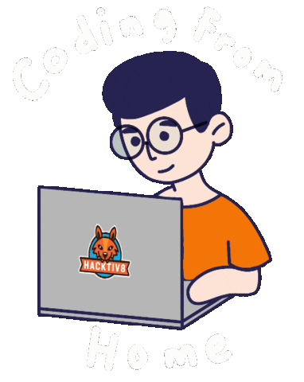

  
   
  <h1>Rafael Sanguino</h1>
  
<strong>Ingeniería de Sistemas | Full Stack Developer en formación</strong>

  
Combinando la formación académica con la construcción de soluciones tecnológicas seguras y escalables.

  
   
  
  

## 🚀 Sobre Mí
Actualmente soy estudiante de Ingeniería de Sistemas. Mi objetivo es consolidar un perfil profesional como Desarrollador Full Stack, complementando mi formación universitaria con la práctica constante en proyectos reales. 

Me apasiona la intersección entre el desarrollo web y la ciberseguridad. Mi filosofía es clara: el código debe ser legible, mantenible y, ante todo, seguro desde el diseño (*Security by Design*).

## 🛠 Tech Stack

| Categoría | Tecnologías |
| :--- | :--- |
| **Frontend** | React, Next.js, HTML5, CSS3 |
| **Backend** | Node.js, Express, TypeScript, Python |
| **Bases de Datos** | MongoDB, PostgreSQL, Firebase |
| **Herramientas** | Git, GitHub, Docker, CI/CD (GitHub Actions/Vercel) |

## 📌 Proyectos Destacados

### 🔐 Sistema de Autenticación Segura (Login/Register)
Arquitectura de autenticación robusta enfocada en la privacidad del usuario.
* **Logro:** Implementación de JWT, hashing con bcrypt y validación estricta de datos.
* [🔗 Repositorio](https://github.com/RafaelSanguinoAriza/Login_Register) | [🌐 Demo Live](https://loginregisterjs.netlify.app/)

### 🔋 EnergyPy: Gestión Eficiente de Energía
Aplicación multiplataforma para la automatización de procesos del sistema.
* **Logro:** Interfaz gráfica (PyQt5) compatible con Windows, Linux y macOS.
* [🔗 Repositorio](https://github.com/RafaelSanguinoAriza/EnergyPy) | [⬇️ Descargar](https://github.com/RafaelSanguinoAriza/EnergyPy/releases/tag/EnergyPy)

### 🐍 Snake: Game Engineering
Desafío lógico centrado en la optimización de algoritmos en tiempo real.
* [🔗 Repositorio](https://github.com/RafaelSanguinoAriza/Sneka_Game)

## 📈 Estadísticas

  
  

---

  <h3>🤝 ¿Colaboramos?</h3>
  
Estoy abierto a nuevas oportunidades, retos técnicos o colaboraciones en el ámbito profesional.

  <a href="mailto:david-0206@hotmail.com"><strong>david-0206@hotmail.com</strong></a>

